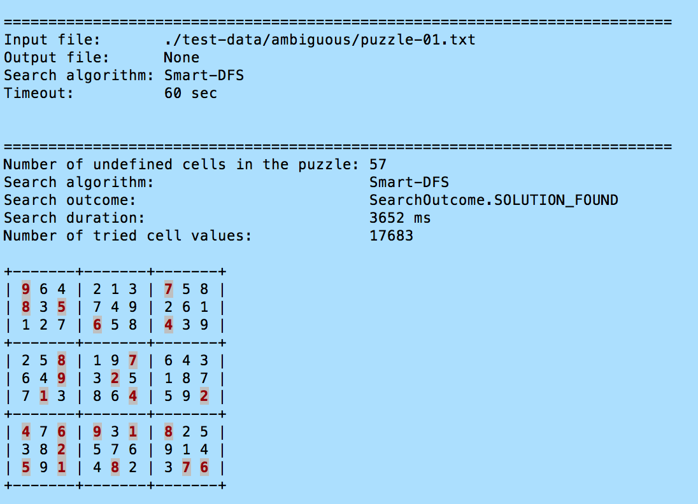
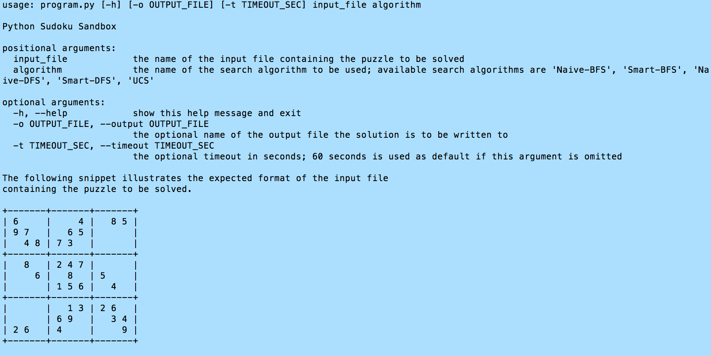

## Python Sudoku Sandbox


### Introduction

Python Sudoku Sandbox is an educational/experimental project. In fact, it is my first Python project consisting of more than one source file. It is a simple console application that takes the given Sudoku puzzle and tries to solve it using the specified search algorithm. When starting the project, I kept the following requirements in my mind:

* The entire project should be affordable within a limited amount of (spare) time.
* I wanted to end up with very clear, intent revealing code, even if more verbose and not necessarilly the most efficient one.
* The design of the application should support various search algorithms, and it has to be possible to add new search algorithm implementations with minimal modification of the existing code.
* Python 3 was the language of choice.
* I wanted to avoid dependencies on any 3rd party modules which are not part of the Python Standard Library.
* Automated test suite providing a reasonable degree of confidence was a must.

From functional point of view, I wanted the application to provide more than just a grid with a solution of the given puzzle. Therefore, the application provides additional information about the completed search, regardless of whether the search has been successful or not. Details are described in the [More about the Search Summary](#more-about-the-search-summary) section of this document. It is also possible to limit the duration of a search with timeout.


### How to Start the Application

The `program.py` module is the entry point of the application. In order to start the application, you have to use a command similar to the following example:

```
python3 program.py ./test-data/ambiguous/puzzle-01.txt Smart-DFS
```

The command is to be executed in the root directory of the project. The two command line arguments used in the example above specify the file containing the puzzle to be solved, plus the search algorithm to be used. Any input file containing a puzzle to be solved is expected in ASCII format. Besides the cell values, it also has to involve a simple border dividing the Sudoku grid to 9 regions. Empty cells are represented by blanks. The following snippet provides an example:

```
+-------+-------+-------+
| 9   8 |   3   |       |
|       |       |   5 9 |
|       | 4     |     8 |
+-------+-------+-------+
|   5 6 |       |       |
| 8   9 | 5     | 7     |
|       | 6 8   | 1     |
+-------+-------+-------+
|   1   |   4   | 8     |
|       | 1     |   7   |
| 4     | 8     |       |
+-------+-------+-------+
```

Depending on the command line arguments, the output can be written either to the standard output (stdout), or to an ASCII file with the same structure as the input file. If stdout is used, the output contains ANSI escape sequences to highlight the predefined cells and distinguish them from cells whose values have been completed by the search algorithm. The following screenshot illustrates the output generated by the application. Besides the highlighting of the predefined cells, the screenshot also demonstrates other information provided by the output:

* **Input parameters** like the name of the file containing the puzzle to be solved, the search algorithm to be used etc.
* The **search summary** mentioned in the [Introduction](#introduction).



The initial example at the beginning of this section illustrated just the basic usage of the application. The following screenshot provides more details about the usage of the application including optional command line arguments and available search algorithms:



The details depicted by the screenshot above were generated by the following command:

```
python3 program.py -h
```


#### More about the Search Summary

As already mentioned before, at the end of each search (regardless whether successful or failed), the application provides detailed search summary which involves the following information:

* Number of undefined cells in the original puzzle. This value reflects the difficulty of the puzzle, although it does not provide the complete picture.
* The search algorithm used to find the solution.
* Search outcome indicating whether the search has found a solution or not. Several search outcomes are possible, they are described below.
* Duration of the search in milliseconds.
* Number of cell values tried during the search. This value (together with the above listed duration of the search) gives you an idea about the efficiency of the search algorithm. You can try to solve the same puzzle using various search algorithms and compare the duration as well as the number of cell values tried.

The above mentioned search outcome can have one of the following values:

* **Solution found** indicates that the search algorithm has successfully solved the puzzle. This is the only search outcome indicating success. The other outcomes indicate failure.
* **Timeout** indicates that the search algorithm has not found solution within the given timeout.
* **Puzzle dead end** indicates that no solution exists for the given puzzle. If the puzzle contains an empty (i.e. undefined) cell, and none of the 9 values is applicable to the cell because all 9 values are already present in the row, the column, or the region containing the empty cell, the puzzle cannot by solved by any search algorithm. Such a situation can be encountered at any time during the search, it does not have to happen at the beginning of the search.
* **Algorithm dead end** is specific to search algorithms unable to deal with the situation when for every undefinded cell, there are at least two applicable candidate values. A search algorithm which is searching for unambiguous candidate values will not be able to deal with such a situation, and the search will fail with algorithm dead end. However, the same puzzle might be solved using other search algorithm which is able to deal with ambiguity.

The following puzzle illustrates the concept of **puzzle dead end**. Regardless of the search algorithm, it should lead to puzzle dead end because no candidate value is applicable to the empty cell in the upper left corner:

* The values 2, 3, 8 and 9 are excluded as they are present in the first row.
* The values 1, 5 and 6 are excluded as they are present in the first column.
* The values 4 and 7 are excluded as they are present in the upper left region.

```
+-------+-------+-------+
|       | 9 3   | 8 2   |
|   7   |       |       |
|     4 |       |       |
+-------+-------+-------+
|       |       |       |
| 5     |       |       |
| 6     |       |       |
+-------+-------+-------+
|       |       |       |
| 1     |       |       |
|       |       |       |
+-------+-------+-------+
```

The following puzzle illustrates the concept of **algorithm dead end**. The cell in the upper left corner is undefined, and the only applicable value is 4. The values 2, 3, 8 and 9 are excluded as they are present in the first row. The values 1, 5 and 6 are excluded as they are present in the first column. The value is 7 excluded because it is present in the first region. As the value 4 is the only remaining canidate, it is unambiguous candidate. For the cell in the bottom right corner, the situation is not so straightforward. The values 3, 4, 5, 6 and 7 are excluded, but the values 1, 2, 8 and 9 are still applicable. In other words, there is no unambiguous candidate for the cell in the bottom right corner. A search algorith not able to deal with such ambiguities is doomed to fail if it encouters undefined cell with two or more candidate values.

```
+-------+-------+-------+
|       | 9 3   | 8 2   |
|   7   |       |       |
|       |       |       |
+-------+-------+-------+
|       |       |       |
| 5     |       |     3 |
| 6     |       |       |
+-------+-------+-------+
|       |       |   5   |
| 1     |       | 7     |
|       | 4   6 |       |
+-------+-------+-------+
```


### Runtime Environment, Source Code Organization etc.

When implementing the project, I used Python 3.6.5, so this version or any higher version should work properly. Chances are older versions will work as well, but I have not tried. There are no dependencies on any 3rd party modules, only Python standard library is used.

As the application is comprised of just few modules, there is no special source code organization using any directory structure. All source files comprising the application are present in the root directory of the project. Here is a brief overview of the modules and their responsibilities:

* [program.py](./program.py) is the main module (i.e. the entry point) of the application.
* [gridio.py](./gridio.py) provides parser for input files with puzzles, plus formatter for grids representing the result of a search.
* [grid.py](./grid.py) provides an object oriented representation of Sudoku grid.
* [searchengine.py](./searchengine.py) provides the search engine.
* [searchalgorithm.py](./searchalgorithm.py) provides types that participate on the contract between the search engine and particular search algorithm implementations.
* [algorithmregistry.py](./algorithmregistry.py) provides registry aware of all available search algorithms. Any new algorithm implementation will have to be registered here.
* [searchsupport.py](./searchsupport.py) provides logic excluding candidate values applicable to an undefined cell, plus logic excluding candidate cells within a region where a value is applicable. This functionality is used by particular search algorithms, so this module supports implementation of search algorithms.
* [ucs.py](./ucs.py) provides the Unabiguous Candidate Search (UCS) algorithm.
* [bfs.py](./bfs.py) provides two implementations of the Breadth First Search (BFS) algorithm
* [dfs.py](./dfs.py) provides two implementations of the Depth First Search (DFS) algorithm.

Besides the modules comprising the application, there are also modules comprising the automated test suite (more details in the [Automated Test Suite](#automated-test-suite) section of this document). The automated test suite resides in subdirectories of the [tests](./tests) directory.


### Logging

The application uses the logging module provided by the Python Standard Library. If the current directory contains a file with the name `logging-config.ini`, it is used as logging configuration. The root directory of the project contains such a file, so you can use it as basis for your own experiments. Look at Python documentation for more information about the structure and content of the configuration INI file. If the configuration file is missing, the application uses a default configuration which is hardcoded in the source code. The default configuration prescribes INFO as log level, and `python-sudoku-sandbox.log` as log file.


### Testing

####  Automated Test Suite

The automated test suite is based on the standard `unittest` module. As already mentioned before, I wanted to avoid dependencies on any modules which are not part of the Python Standard Library. Therefore, I did not consider `PyTest` as option.

The automated test suite spans two test levels:

* **Unit tests** exercise individual classes in isolation.
* **Integration tests** cover almost the entire application.

The above listed combination of test levels is a pragmatic approach that allowed me to gain a solid degree of confidence with an affordable effort. In order to start the entire test suite (i.e. unit tests as well as integration tests), execute the following command in the root directory of the project:

```
python3 -m unittest discover -s ./tests -p *_tests.py
```

##### Unit Tests

As already mentioned before, the provided unit tests tend to exercise individual classes in isolation. Some of the unit tests exercise a bunch of closely related classes together, but they are still pure unit tests as they do not touch the file system, they do not involve any interprocess communication etc. Some of the unit tests also use `unittest.mock` module in order to isolate the tested class from its dependencies.

The unit tests reside in the [tests/unit](./tests/unit) directory. In order to start them (without the integration tests), execute the following command in the root directory of the project:

```
python3 -m unittest discover -s ./tests/unit -p *_tests.py
```

The names of the unit test modules strictly follow a naming convention. In concrete terms, the name of a test module is always derived from the name of the tested module, and the test modules use the `_test` suffix. For instance, the name of the test module testing the functionality provided by the `grid.py` module is `grid_tests.py`.


##### Integration Tests

These tests cover virtually the entire application as they exercise the following functionalities:

* Parsing of puzzles.
* Search engine driving the search, including instantiation of search algorithms.
* Particular search algorithms.
* Formatting of the solution.

Various categories of puzzles are covered:

* Valid puzzles leading to solution (both unambiguous and ambiguous puzzles are covered).
* Invalid puzzles violating Sudoku rules by containing duplicate value(s) in a row, in a column, or in a region.
* Invalid puzzles that cannot be parsed (e.g. the input file contains invalid characters, an incomplete or crippled grid etc.).
* Puzzles leading to both dead ends.
* Puzzles leading to timeout.

The list of functionalities not covered by the integration tests is rather short:

* The main module with the processing of command line arguments, formatting of search summary and help concerning the usage and command line arguments.
* The highlighting of predefined cells based on ANSII escape sequences.


The integration tests reside in the [tests/integration](./tests/integration) directory. In order to start them (without the unit tests), execute the following command in the root directory of the project:

```
python3 -m unittest discover -s ./tests/integration -p *_tests.py
```


#### Test Data for Manual Testing

The project also invlves test data for manual testing. The [test-data](./test-data) directory contains several subdirectories containing input files with puzzles. There are several types of puzzles, and each type has its own directory.

* The [test-data/unambiguous](./test-data/unambiguous) directory contains puzzles which are unambiguous. Even the Unabiguous Candidate Search (UCS) described in one of the subsequent sections of this document can solve these puzzles.
* The [test-data/ambiguous](./test-data/ambiguous) directory contains puzzles which are ambiguous. These can only be solved by brute force algorithms which are able to deal with the situation when for each of the undefined cells, at least two candidate values are applicable.
* The [test-data/puzzle-dead-end](./test-data/puzzle-dead-end) directory contains puzzles which cannot be solved, regardless of the search algorithm used. The reason for the dead end is the fact that these puzzles contain an undefined cell for which no value is applicable. For such a cell, each of the nine values is already present in the row, the column, or the region containing the cell.


### Search Algorithms

Currently, the project involves five search algorithms:

* **Unabiguous Candidate Search (UCS)** is looking for empty (i.e. undefined) cells for which all candidate values except of one have been excluded. This algorithm is unable to deal with ambiguous puzzles - when it encounteres a situation when two or more candidate values are applicable to each of the undefined cells, the search is aborted with algorithm dead end. For better understanding of the exclusion logic behind this algorithm, look at the [unit tests for the search support module](./tests/unit/searchsupport_tests.py), namely the `CandidateValueExclusionLogicTest` and `CandidateCellExclusionLogicTest` test fixtures. If this algorithm finds a solution for a puzzle, the number of cell values tried should be equal to the number of undefined cells in the original puzzle.
* **Naive Depth-First Search (Naive-DFS)** and **Smart Depth-First Search (Smart-DFS)** are two implementations of the well-known depth-first search algorithm. It is a brute force algorithm whose implementation is based on stack. As a brute force algorithm, it is able to deal with ambiguities. In other words, it is able to deal with situations when two or more candidate values are applicable to each of the undefined cells. The smart variant is serching for undefined cell with least applicable candidate values, thus minimizing the number of candidate values for a single undefined cell that will have to be tried. The naive variant simply takes the undefined cells in the order from the upper left corner to the bottom right corner. Compared to the smart approach, the naive approach will most likely try significantly more candidate values, thus leading to more time consuming search.
* **Naive Breadth-First Search (Naive-BFS)** and **Smart Breadth-First Search (Smart-BFS)** are two implementations of the well-known breadth-first search algorithm. It is a brute force algorithm whose implementation is based on queue. Similarly to the above described depth-first search algorithm, it is able to deal with ambiguities. The distinction between the naive and the smart implementation is equivalent to the above described two implementations of the depth-first search algorithm.

Both above mentioned naive implementations are rather useless. For many puzzles, they will just fail with timeout, even if you use a large timeout like 5 or 10 minutes. However, I decided to provide them for demonstration purposes. If you use them, look at the number of tried cell values in the search summary - it will give you an idea about how inefficient these algorithms are.


### Few Words about the Design of the Application

#### Grid

As already stated in one of the former sections of this document, when presenting a solved puzzle, I wanted to distinguish between predefined and completed cells. In order to meet this requirement, the grid must keep track of the status of a cell. Therefore, just a number is not enough to represent a cell - the representation must carry the cell value as well as the cell status. As some of the search algorithms involve cloning of the grid whenever they try to apply a cell value, I decided to implement the cell representations as immutable singletons. In practical terms, there are 9 predefined cells plus 9 completed cells. In addition, there is single undefined cell. As these singletons are immutable, it is safe to share them among grids. Such a design prevents unnecessary creation of short-lived objects and reduces the overhead of cloning.


#### SearchSupport

Each of the search algorithms works with instance(s) of the `Grid` class as well as with instances of exclusion logic clasess provided by the [searchsupport](./searchsupport.py) module. Therefore, the `searchsupport` module provides the `SearchSupport` class which aggregates and coordinates an instance of `Grid` with instances of the above mentioned exclusion logic classes. Such a design prevents code duplication and simplifies implementation of the search algorithms. Even new search algorithm implementations are supposed to use the `SearchSupport` class which is a facade encapsulating the internals of the `searchsupport` module. Search algorithm implementations are not permitted to use the other classes directly.


#### Search Engine, Contract between Search Engine and Search Algorithm Implementations

The class `SearchEngine` provided by the [searchengine](./searchengine.py) module is one of the key components of the entire application. It:

* instantiates the desired search algorithm
* controls/drives the search by invocations of methods implemented by the search algorithm
* measures the duration of the search and takes care for handling of timeout
* counts the number of cell values tried

For a successful implementation of a new search algorithm, the understanding of the contract between the `SearchEngine` and the search algorithm implementations is crucial. Any search algorithm implementation must provide:

* an initializer (i.e. the `__init__`) method with one and only parameter, namely the `self` reference. Any other parameters are forbidden. This is a precondition for successfull instantiation of the search algorithm by the search engine.
* `start` method with two parameters, namely the `self` reference and a reference to a `Grid` instance representing the puzzle to be solved. The `start` method is supposed to initialize the algorithm and prepare it for the first search step (i.e. the very first invocation of the `next_step` method). However, the `start` method is not supposed to set any cell values. The `start` method has no return value.
* `next_step` method with `self` reference as the one and only parameter. Single invocation of this method is supposed to apply a single cell value. The search engine counts the number of invocations of the `next_step` method in order to determine the number of cell values tried by the search. This method returns one of the elements of the `SearchStepOutcome` enum (see [searchalgorithm](./searchalgorithm.py) module). If the `next_step` method cannot apply any cell value, it has to abort the search by returning one of the enum elements indicating dead end.
* `last_step_outcome` property providing access to a `Grid` instance representing the status of the search after the last invocation of the above described `next_step` method.
